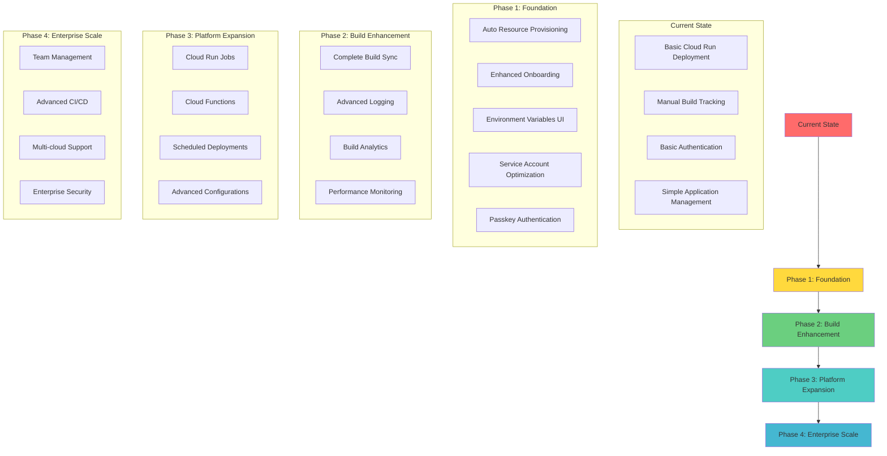

# OmniDeploy Run - Product Roadmap

> **Vision**: Transform complex cloud deployment into a simple, Vercel-like experience for Google Cloud Platform

## Overview

OmniDeploy Run aims to democratize cloud deployments by providing an intuitive platform that abstracts away the complexity of Google Cloud Platform while maintaining its full power. Our goal is to create a deployment experience as simple as connecting a GitHub repository and hitting deploy.

## Current State

**✅ Completed Features:**

- GitHub repository connection and authentication
- Cloud Build trigger creation and management
- Cloud Run service deployment automation
- Real-time build log streaming with fullscreen viewer
- Application settings management (CPU, memory, port, public access)
- Complete CRUD operations for applications
- Two-phase deletion (Cloud Build trigger + Firestore cleanup)
- Better Auth integration with authentication framework
- Custom Firestore adapter for user management

**🚧 In Progress:**

- Application environment variables management (code exists, needs UI implementation)
- Comprehensive build history tracking

**🔮 Planned:**

- Passkey authentication management (Better Auth framework ready, implementation pending)

---

## Roadmap Phases

### Phase 1: Foundation & Onboarding Enhancement

**Timeline**: Q1 2026
**Priority**: High

#### 1.1 Enhanced Onboarding Experience

- **Automated Resource Provisioning**
  - Auto-provision Firestore database during setup
  - Create dedicated service accounts automatically
  - Set up proper IAM roles and permissions
  - Initialize Cloud Build APIs and configurations

- **Service Account Optimization**
  - Create dedicated build service accounts (separate from application runtime)
  - Implement least-privilege security model
  - Automated credential rotation capabilities

- **Guided Setup Wizard**
  - Step-by-step onboarding flow
  - Resource verification and health checks
  - Rollback capabilities for failed setups

#### 1.2 Environment Variables Management

- **UI Implementation**
  - Secure environment variable editor
  - Support for different environments (dev, staging, prod)
  - Import/export capabilities
  - Secret management integration

- **Security Enhancements**
  - Integration with Google Secret Manager
  - Encryption at rest and in transit
  - Access logging and audit trails

#### 1.3 Authentication Enhancement

- **Passkey Implementation**
  - Passwordless authentication using WebAuthn
  - Biometric and hardware security key support
  - Reduced signup friction and improved security
  - Multi-device passkey synchronization

### Phase 2: Build System Enhancement

**Timeline**: Q2 2026
**Priority**: High

#### 2.1 Comprehensive Build Tracking

- **Real-time Build Synchronization**
  - Background service to sync all Cloud Build executions
  - Automatic build detection and cataloging
  - Historical build data migration

- **Enhanced Build Management**
  - Build artifact management
  - Build comparison and diff views
  - Build performance analytics
  - Failed build debugging tools

#### 2.2 Advanced Logging & Monitoring

- **Improved Logging Experience**
  - Multi-stream log aggregation
  - Log filtering and search capabilities
  - Export and sharing functionality
  - Real-time collaboration features

### Phase 3: Platform Expansion

**Timeline**: Q3-Q4 2026
**Priority**: Medium

#### 3.1 Deployment Type Diversification

- **Cloud Run Jobs**
  - Batch processing and scheduled tasks
  - Job monitoring and management
  - Resource scaling for compute-intensive tasks

- **Cloud Functions**
  - Serverless function deployment
  - Event-driven architecture support
  - Function composition and workflows

- **Scheduled Deployments**
  - Cron job management
  - Cloud Scheduler integration
  - Automated deployment pipelines

#### 3.2 Advanced Configuration Management

- **Progressive Configuration**
  - Basic mode: Minimal required settings
  - Advanced mode: Full Google Cloud capabilities
  - Smart defaults and recommendations

- **Infrastructure as Code**
  - Template-based deployments
  - Version-controlled configurations
  - Terraform integration possibilities

### Phase 4: Enterprise & Scale

**Timeline**: 2027
**Priority**: Medium-Low

#### 4.1 Team & Organization Features

- **Multi-user Support**
  - Team management and permissions
  - Project sharing and collaboration
  - Role-based access control

#### 4.2 Advanced DevOps Integration

- **CI/CD Pipeline Enhancement**
  - Advanced deployment strategies (blue-green, canary)
  - Automated testing integration
  - Performance monitoring and alerts

- **Ecosystem Integration**
  - Docker registry management
  - Database migration tools
  - Third-party service integrations

---

## Technical Priorities

> From Next Year:

### Immediate (Next 3 months)

1. **Environment Variables UI** - Complete the existing codebase implementation
2. **Build Sync Service** - Background job to sync all Cloud Build data
3. **Enhanced Onboarding** - Automated resource provisioning
4. **Passkey Authentication** - Implement passwordless login to reduce signup friction

### Short-term (3-6 months)

1. **Service Account Separation** - Dedicated build vs runtime accounts
2. **Secret Management** - Google Secret Manager integration
3. **Advanced Logging** - Filtering, search, and export capabilities

### Medium-term (6-12 months)

1. **Cloud Run Jobs** - Expand beyond web services
2. **Advanced Settings** - Progressive disclosure of configuration options
3. **Performance Analytics** - Build and deployment metrics

### Long-term (12+ months)

1. **Multi-cloud Support** - Begin AWS/Azure research
2. **Enterprise Features** - Team management and SSO
3. **Marketplace** - Template and plugin ecosystem

---

## Success Metrics

### User Experience

- **Onboarding Time**: Reduce from ~30 minutes to <5 minutes
- **Deployment Success Rate**: Achieve >95% first-attempt success
- **Authentication Friction**: <30 seconds from landing page to authenticated state
- **User Satisfaction**: Target NPS (Net Promoter Score) >50

### Technical Performance

- **Build Sync Accuracy**: 100% build visibility
- **Platform Uptime**: >99.9% availability
- **Response Time**: <2 second average page load

### Business Impact

- **User Adoption**: 10x growth in active deployments
- **Feature Usage**: >70% of users using advanced features
- **Customer Retention**: >80% monthly active user retention

---

## Summary

OmniDeploy Run is positioned to become the **"Vercel for Google Cloud"** - a platform that makes enterprise-grade cloud deployments as simple as connecting a GitHub repository. Our roadmap focuses on three core principles:

🎯 **Simplicity First**: Default to minimal configuration while providing powerful advanced options  
🔧 **Full Automation**: From resource provisioning to deployment monitoring  
🚀 **Developer Experience**: Intuitive interface that doesn't sacrifice functionality

**Key Milestones:**

- **Q1 2026**: Enhanced onboarding with auto-provisioning, environment variables, and passkey authentication
- **Q2 2026**: Complete build visibility and advanced logging capabilities
- **Q3-Q4 2026**: Platform expansion with Cloud Run Jobs, Functions, and Schedules
- **2027**: Enterprise features and advanced DevOps integrations

This roadmap transforms OmniDeploy Run from a proof-of-concept into a production-ready platform that democratizes cloud deployments for developers of all skill levels.

---

## Architecture Evolution Diagram

---

_Last Updated: November 11, 2025_  
_Document Version: 1.0_
